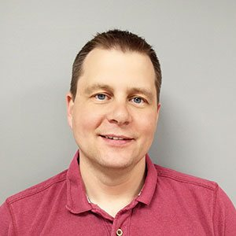

# Talks
I have worked with Azure for years now and work closely with various teams in Microsoft to test, provide feedback and help improve the Azure offerings, in particular around security and compliance.

I like talking about Azure so I am available to do a number of talks at community events. 

## Current talks
- [GDPR for Software Builders](GDPR_for_software_builders.md)  
(more talks on GDPR aimed at other audiences coming soon)
- [SQL Azure - the intelligent cloud database](SQL_Azure_the_intelligent_cloud_database.md)
- [Securing web apps in azure](Securing_web_apps_in_azure.md)

## Short speaker profile
CTO and CISO at NewOrbit; architecting and implementing large and small-scale software for our customers, all running on Azure.

## Long speaker profile
Moving software to the cloud since 2006.

CTO and CISO at [NewOrbit](https://www.neworbit.co.uk); architecting and implementing large and small-scale software for our customers, all running on Microsoft Azure.

Helping other companies move to Azure as part of our Gold Cloud Partnership with Microsoft.

Obsessed with security and excited by how much easier Azure makes it to be GDPR compliant.

## Picture

